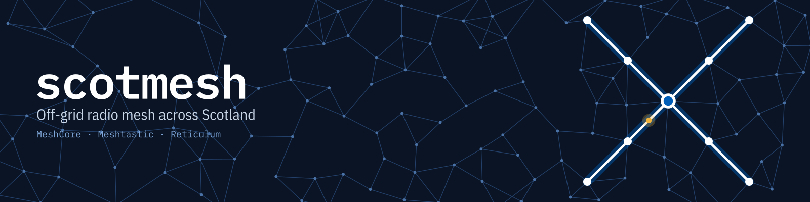

# ScotMesh branding

The full guidelines, with specs, rules and every download, are at **[scotmesh.github.io/branding](https://scotmesh.github.io/branding/)**.

Logos, colours, type and graphics for every platform ScotMesh uses: GitHub, Discord, Facebook, YouTube, X, Mastodon, Bluesky and our websites. There are versions for the community as a whole and for each network we run: MeshCore, Meshtastic and Reticulum.

## The mark

The saltire drawn as a mesh: four nodes linked through a node at the centre, with fainter neighbours meshing around the edge. It's the flag and the network in one shape.

| Mark | On light | On dark |
| --- | --- | --- |
|  |  |  |
| `logo/scotmesh-mark.svg` | `logo/scotmesh-glyph-blue.svg` | `logo/scotmesh-glyph-white.svg` |

**Small sizes.** Below 48px, use `logo/scotmesh-mark-small.svg`. It drops the faint outer mesh and thickens the links so the saltire still reads at 16px. The favicons are built from it.

**Clear space.** Keep at least 10% of the mark's width clear on every side, about half a corner node.

**Don't** recolour the mark outside the palette, rotate it (a turned saltire is just a plus sign), stretch it, or put the blue mark on a busy photo without its field.

## Network versions

Anything that belongs to one network gets that network's version: its tools, websites, wiki, repos, Discord roles and channels. Where a logo appears, use the network lockup (`scotmesh/meshcore`), not the plain ScotMesh one. Network marks sit on Night instead of saltire blue, and the network's colour fills the centre node and the outer mesh, so they read as part of the family and still differ at 16px.

| | Network | Tint | Deep (text on light) | Files |
| --- | --- | --- | --- | --- |
|  | MeshCore | `#56B4F5` | `#0069A6` | `networks/meshcore/` |
|  | Meshtastic | `#65C281` | `#05773B` | `networks/meshtastic/` |
|  | Reticulum | `#B199F4` | `#6A51A4` | `networks/reticulum/` |

The three tints share one lightness and saturation (oklch 0.74 / 0.13) and differ only in hue, so no network looks louder than the others. Each is at least 7:1 against Night.

Every network folder has the same set:

| File | Size | Use |
| --- | --- | --- |
| `mark.svg`, `mark-1024.png`, `mark-512.png` | | Avatars for the network's tools, bots and repos |
| `mark-small.svg`, `favicon.ico`, `favicon-16/32/48.png`, `apple-touch-icon.png` | | Browser icons for the network's tools |
| `lockup-on-dark.svg/png`, `lockup-on-light.svg/png` | | `scotmesh/meshcore` alongside the mark |
| `lockup-stacked-on-dark.svg/png`, `lockup-stacked-on-light.svg/png` | about 4:1 | `scotmesh` over `/meshcore` beside the mark. **The default for anything belonging to one network**: nav bars, site headers, README section headings |
| `lockup-short-on-dark.svg/png`, `lockup-short-on-light.svg/png` | 5.6:1 | The network mark with `scotmesh`, only where the network is already obvious and space is very tight |
| `readme-header.svg/png` | 1600×400 | README banner for the network's repos |
| `github-social-preview.svg/png` | 1280×640 | Repo social preview |
| `og-image.svg/png` | 1200×630 | Link previews for the network's websites |
| `header.svg/png` | 1500×500 | Social headers, for example a network-specific account |
| `header-mesh.svg` | 1500×500 | Header art with no text, for the network's websites |
| `discord-role-icon.png` | 64×64 | Discord role icon for the network's role |
| `discord-emoji.png` | 128×128 | Discord custom emoji, e.g. `:meshcore:` |

## Wordmark

The name is always set lowercase in IBM Plex Mono SemiBold: **scotmesh**. In running text, write it as ScotMesh. Network names follow a slash in the network's tint: **scotmesh/reticulum**.

| On light | On dark |
| --- | --- |
| `wordmark/scotmesh-lockup-on-light.svg` | `wordmark/scotmesh-lockup-on-dark.svg` |
| `wordmark/scotmesh-wordmark-on-light.svg` | `wordmark/scotmesh-wordmark-on-dark.svg` |

All text in the SVGs is converted to outlines, so nothing depends on the fonts being installed.

## Colour

| | Name | Hex | Use |
| --- | --- | --- | --- |
|  | Saltire | `#005EB8` | The mark's field, links and primary actions. Pantone 300, the saltire blue. |
|  | Night | `#0A1424` | Dark backgrounds and text on light. |
|  | Mist | `#E6EDF7` | Light backgrounds and text on dark. |
|  | Signal | `#F2B33D` | Sparingly: a packet in flight, a live status, one highlight per view. |

Supporting tints used in the banners: mesh links `#23406A`, mesh nodes `#4B72A6`, secondary text on Night `#C9D6E8` and `#7FA7D9`. Network tints are listed under [Network versions](#network-versions).

## Type

- **IBM Plex Mono**: the wordmark, headings, node IDs, frequencies and anything technical.
- **IBM Plex Sans Condensed**: body copy and taglines.

Both are free under the SIL Open Font License, available from [Google Fonts](https://fonts.google.com/?query=IBM+Plex) or [IBM](https://github.com/IBM/plex). `web/fonts/` has the `woff2` files for self-hosting.

## Platforms

Every PNG banner has a matching SVG next to it.

### GitHub

| File | Size | Where |
| --- | --- | --- |
| `github/org-avatar.png` | 1024×1024 | Organisation settings → Profile picture |
| `github/social-preview.png` | 1280×640 | Repo settings → Social preview (network repos use `networks/<network>/github-social-preview.png`) |
| `social/readme-header.png` | 1600×400 | Top of READMEs (network repos use `networks/<network>/readme-header.png`) |

### Discord

| File | Size | Where |
| --- | --- | --- |
| `discord/server-icon.png` | 512×512 | Server settings → Server icon. Discord crops it to a circle; the mark is built to survive that |
| `discord/banner.png` | 960×540 | Server banner, needs boost level 2 |
| `discord/invite-splash.png` | 1920×1080 | Invite background, needs boost level 1. The saltire sits right of centre, clear of the invite card |
| `discord/discovery-splash.png` | 1920×1080 | Server Discovery listing, for Community servers in Discovery |
| `discord/event-cover.png` | 800×320 | Scheduled event cover image |
| `discord/sticker-scotmesh.png` | 320×320 | Server sticker |
| `discord/emoji-scotmesh.png` | 128×128 | Custom emoji `:scotmesh:` |
| `networks/<network>/discord-emoji.png` | 128×128 | Custom emoji `:meshcore:`, `:meshtastic:`, `:reticulum:` |
| `networks/<network>/discord-role-icon.png` | 64×64 | Role icons for network roles, needs boost level 2 |
| `logo/scotmesh-mark-512.png` | 512×512 | Bot and webhook avatars (network bots use their network's `mark-512.png`) |

### Facebook

| File | Size | Where |
| --- | --- | --- |
| `facebook/group-cover.png` | 1640×856 | Group cover photo. Mobile crops the sides, so everything important sits in the middle |
| `facebook/event-cover.png` | 1920×1005 | Event cover photo |
| `facebook/profile.png` | 720×720 | Page profile picture, if we run a Page as well as the group |

### YouTube

| File | Size | Where |
| --- | --- | --- |
| `youtube/banner.png` | 2560×1440 | Channel banner. The wordmark and saltire sit inside the 1546×423 area shown on every device |
| `youtube/profile.png` | 800×800 | Channel picture |

### X, Mastodon and Bluesky

| File | Size | Where |
| --- | --- | --- |
| `x-mastodon/header.png` | 1500×500 | X and Mastodon header. Text sits high, above where the profile picture overlaps |
| `x-mastodon/avatar.png` | 400×400 | X and Mastodon profile picture |
| `bluesky/banner.png` | 3000×1000 | Bluesky banner |
| `bluesky/avatar.png` | 1000×1000 | Bluesky avatar |

### Websites

| File | Use |
| --- | --- |
| `web/favicon.svg`, `web/favicon.ico`, `web/favicon-16/32/48.png` | Browser icons |
| `web/apple-touch-icon.png` | iOS home screen (180×180) |
| `web/icon-192.png`, `web/icon-512.png`, `web/icon-maskable-512.png`, `web/site.webmanifest` | Android and installable web apps |
| `web/og-image.png` | Link previews, 1200×630 (Discord, Facebook, Slack, iMessage) |
| `web/header-mesh.svg` | Header art with no text, kept sparse on the left so headings sit over it |
| `web/fonts/` | IBM Plex `woff2`, so sites don't need to load fonts from Google |

[scotmesh.net](https://github.com/ScotMesh/scotmesh.net) and [rns.scotmesh.net](https://github.com/ScotMesh/rns.scotmesh.net) show these in use.

## Building

Everything is generated from `src/build.mjs`, so change the geometry or colours there rather than editing outputs by hand.

```sh
npm install
npm run build
```

Needs Node 18+, `rsvg-convert` (librsvg) and ImageMagick's `magick` on your `PATH`. The fonts in `src/fonts/` are IBM Plex, redistributed under the [SIL Open Font License](src/fonts/OFL.txt).
